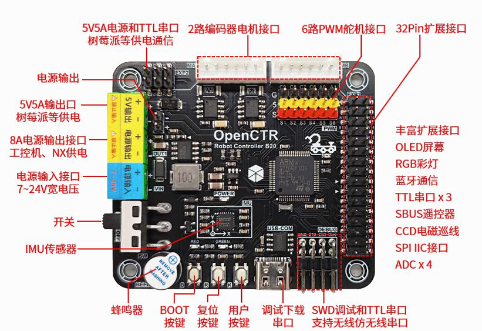
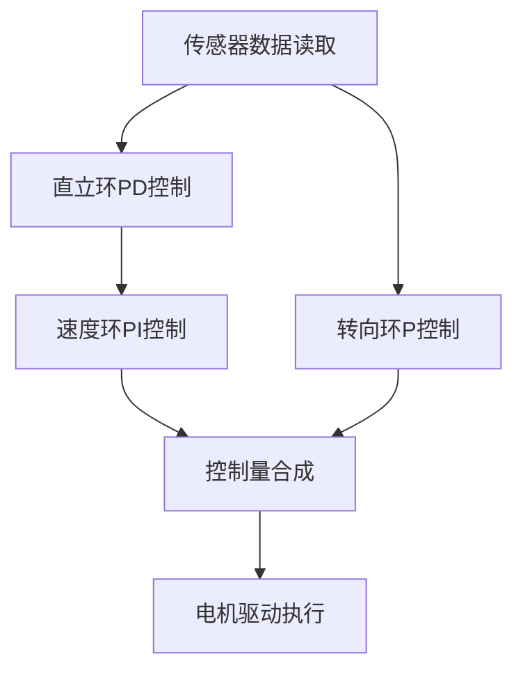
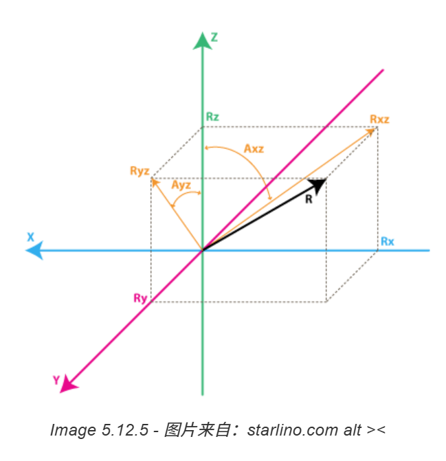

---

## 1. 系统总体架构

### 硬件组成（采用塔克创新openB20主控板）
- IMU：MPU6050 6 轴（陀螺仪 + 加速度计）用于测角度／角速度测量
* STM32F103RCT6，ARM Cortex-M3内核，72M主频，48KRAM，256KFLASH
- 

* MC310编码器减速电机 + 霍尔编码器 
* + TB6612电机驱动器
* 电池采用一块7.4V锂电池组
* 遥控：

### 软件/控制逻辑流程



---

## 2. 软件模块划分

可以按以下模块组织你的代码：


---

## 3. 倾斜检测

小车只会前后倾斜所以只用测得`pitch`即可：


* 用 IMU 的加速度计估计倾斜角
	* 
	1. 先确认小车的x\y\z三个的对应方向（x轴右侧，y轴前方，z轴垂直向上）
	2. 将加速度单位转换为g,角速度为°/s
	3. 计算俯仰角

```C
// 读取MPU6050原始数据
mpu6050_read_data(acc, gyro);

// 计算加速度计角度（atan2参数顺序和坐标系定义相关，请根据实际调整）
// Y轴和Z轴在平衡平面内，计算倾角
acc_angle = atan2(acc[1], acc[2]) * 180.0f / M_PI;
```
* 用 IMU 的陀螺仪测量角速度，再积分得到角度变化。
* 因为直接从加速度计计算角度有噪声而且陀螺仪的角度也会==漂移==，所以使用互补滤波将两者融合，以获得稳定且响应快的倾斜角度估计。 
* 互补滤波公式：
  
```c
// 互补滤波系数
#define ALPHA                 0.98f  // 使用f后缀明确为float类型
#define DT                    0.01f  // 10ms采样周期对应的秒数
#define M_PI                  3.1415926535f  // 提高圆周率精度
float complementary_filter(float acc_angle, float gyro_rate, float dt)
{
    // 核心公式：角度 = α × (上一角度 + 陀螺仪积分) + (1-α) × 加速度计角度
    last_angle = ALPHA * (last_angle + gyro_rate * dt) + (1 - ALPHA) * acc_angle;
    return last_angle;
} 
car_angle = complementary_filter(acc_angle, gyro[0], DT);
```
  
  这里取α ≈ 0.98 。

## 4. 内外环PID 控制器实现
直立环（PD控制） + 速度环控制（PI控制）
 - 直立环根据**车身倾角（P）** 和**角速度（D）** 计算出一个基础的控制量。因为角度偏差越大或角速度越大，电机抵抗也要强，所以次环路响应要迅速
 - 只有直立环的化，小车可能会持续向某方向运动，所以假如直立环。通过编码器测量电机转速所形成的一个正反馈来控制速度。
 
### 调试过程
#### 1.先调试直立环

- ##### 直立环代码

```c
// 直立环，稳定
#define balance_kp 150 // 经测试此时反应最适当，同时稳态误差小
#define balance_kd 5	// 抖动情况最小

int16_t balance_angle_ctl(int16_t target, float angle, float gyro)
{ 
	
	float angle_bias,gyro_bias;  //角度和角速度偏差
	int16_t p_out,d_out,out;    //PID输出值
	
	//计算平衡角度偏差
	angle_bias = target - angle;  
	
	//计算平衡角速度偏差
	gyro_bias  = 0 - gyro;  
	
	//计算平衡角度控制PWM输出，pk，pd为系数，out = kp*e(k) + kd*[e(k)-e(k-1)]
	p_out = balance_kp * angle_bias;
	d_out = balance_kd * gyro_bias;
	
	//计算总输出值
	out =  p_out + d_out;
	
	//调试数据查看
	//printf("@%d %d %d \r\n ",out, p_out, d_out); 
	printf("@%d %d \r\n ",target, (int)angle); 
	
	return out;
}
```

#### 2.调试速度环
- 先计算车轮速度
	1. 一个车轮转一圈的距离是L = Π * D（轮径）
	2. 每转一圈输出`WHEEL_RESOLUTION`个脉冲
	3. pid控制器每秒运行PID_RATE（100）次
	4. 每个脉冲对应的线位移 = (π × D) / WHEEL_RESOLUTION （单位：米／脉冲
	5. 本周期内的脉冲增量 Δn → 位移 Δs = Δn × (π × D) / WHEEL_RESOLUTION
	6. 平均速度 v = Δs / Δt = Δn × (π × D) / WHEEL_RESOLUTION × PID_RATE
	
- 
  ```C
	#define  PI           3.1416     //圆周率PI
	#define  PID_RATE     100         //PID频率
	#define  WHEEL_DIAMETER	      0.066	  //轮子直径
	#define  WHEEL_BASE           0.167	  //轮距，左右轮的距离
	#define  WHEEL_RESOLUTION     2496.0  //编码器分辨率(13线),减速比30,13x30x4=1560
	#define  WHEEL_SCALE          (PI *WHEEL_DIAMETER*PID_RATE/WHEEL_RESOLUTION)  //轮子速度m/s与编码器转换系数

    //通过编码器获取车轮实时转速m/s，前进正，后退负
	int16_t wheel_vel_l = (float)- ((int16_t)encoder_a_get()*WHEEL_SCALE);  //左轮转速
	encoder_a_set(0);
	int16_t wheel_vel_r = (float) ((int16_t)encoder_b_get()*WHEEL_SCALE);  //右轮转速
	encoder_b_set(0);	
	int16_t wheel_vel = (wheel_vel_l + wheel_vel_r)/2;	//计算小车速度	
  ```
---
```C
int16_t balance_velocity_ctl(int16_t t_vx, float r_vx)
{ 
	
	static float velocity_bias = 0, velocity_bias_update;
	static float velocity_integral = 0;
	float  velocity_target;  //速度目标值
	int16_t p_out,i_out,out; //PID输出值
	
	//目标速度限幅
	if(t_vx > 700) t_vx = 700;
	else if(t_vx <-700) t_vx = -700;
	
	//计算瞬时速度偏差，目标速度为0
	velocity_bias_update = 0 - r_vx;
	
	//一阶低通滤波器, 减小速度波动对平衡控制影响
	velocity_bias = (velocity_bias*0.6) + (velocity_bias_update*0.4); 
	
	//速度积分计算出位移，单位m，积分时间10ms
	velocity_integral += velocity_bias*0.01f;  
	
	//计算目标速度（单位为m/s）,vx单位为mm/s,积分时间0.01s
	velocity_target = t_vx*0.001f*0.01f;
	
	//加入目标速度控制，控制行驶速度
	velocity_integral += velocity_target; 

	//限制积分饱和
	if(velocity_integral > 1.5)  velocity_integral = 1.5;
	else if(velocity_integral < -1.5)  velocity_integral = -1.5;

	//计算速度控制PWM输出，pk，pi为系数
	p_out =  -velocity_kp * velocity_bias;
	i_out =  -velocity_ki * velocity_integral;
	
	//计算总输出值
	out =  p_out + i_out;
	
	
	return out;

}
```

---

## 5. FreeRtos控制

```c
```

---

## 6. FreeRtos控制


---

## 7. 项目结构

```

```


